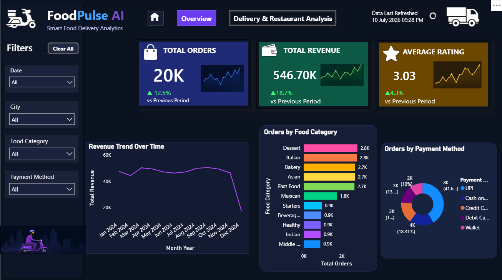
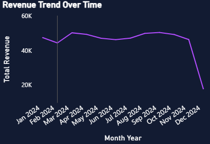
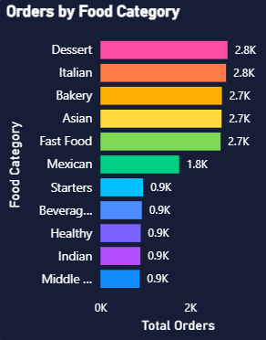
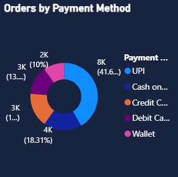
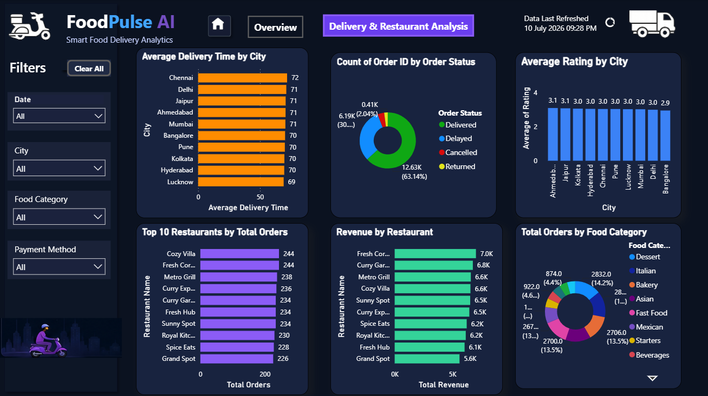

<div align="center">

# 🍔 FoodPulse AI
### 🚚 Smart Food Delivery Analytics Dashboard using Microsoft Power BI

<p align="center">
An Interactive Business Intelligence Dashboard for Food Delivery Operations Analysis
</p>

<p align="center">


</p>

---

### 📊 Turning Raw Food Delivery Data into Actionable Business Insights

*"Data tells a story. Business Intelligence helps organizations understand it."*

---

</div>

# 📑 Table of Contents

- Project Overview
- Problem Statement
- Objectives
- Business Impact
- Dashboard Preview
- Project Architecture
- Project Workflow
- Features
- Repository Structure
- Dataset Information
- Data Cleaning
- Data Modeling
- DAX Measures
- Dashboard Design
- Business Insights
- Technologies Used
- Installation
- Future Scope
- Contributors
- References

---

# 📌 Project Overview

FoodPulse AI is an interactive Business Intelligence dashboard developed using **Microsoft Power BI** to analyze food delivery operations and transform raw transactional data into meaningful business insights.

The dashboard enables business owners, restaurant managers, and delivery partners to monitor key operational metrics such as:

- Revenue
- Orders
- Delivery Performance
- Customer Ratings
- Restaurant Performance
- Payment Trends
- Food Category Demand

Instead of manually analyzing thousands of records, the dashboard presents all important business metrics through dynamic visualizations, KPIs, interactive filters, and drill-down capabilities.

The project demonstrates the complete Business Intelligence lifecycle including:

- Data Collection
- Data Cleaning
- Data Transformation
- Data Modeling
- DAX Calculations
- Dashboard Design
- Interactive Visualization
- Business Insight Generation

---

# ❗ Problem Statement

Food delivery companies generate thousands of records every day.

Without Business Intelligence tools, it becomes difficult to answer questions like:

- Which restaurants generate the highest revenue?
- Which cities have longer delivery times?
- Which payment method is preferred by customers?
- Which food category receives the highest number of orders?
- How does revenue change over time?
- Which restaurants need operational improvements?

Traditional spreadsheets make this analysis time-consuming.

Our solution was to build an interactive dashboard capable of answering these business questions instantly.

---

# 🎯 Project Objectives

The primary objectives of this project are:

✔ Analyze overall business performance

✔ Monitor Total Revenue

✔ Track Total Orders

✔ Measure Customer Satisfaction

✔ Analyze Delivery Efficiency

✔ Compare Restaurant Performance

✔ Study Food Category Demand

✔ Analyze Payment Preferences

✔ Enable Interactive Filtering

✔ Provide Business Insights for Better Decision Making

---

# 🌍 Business Impact

The dashboard helps management:

- Improve operational efficiency
- Reduce delivery delays
- Identify top-performing restaurants
- Improve customer satisfaction
- Understand customer purchasing behavior
- Optimize food inventory
- Improve revenue planning
- Make data-driven business decisions

---

# 🖥 Dashboard Preview

## 📌 Overview Dashboard

> *(Replace with your screenshot after uploading)*

```
Images/dashboard-overview.png
```

---

## 📌 Delivery & Restaurant Analysis

> *(Replace with your screenshot after uploading)*

```
Images/dashboard-analysis.png
```

---

# 🏗 Project Architecture

```
                    +----------------------+
                    |  Kaggle Dataset      |
                    +----------+-----------+
                               |
                               |
                     Import into Power BI
                               |
                               |
                 +-------------+--------------+
                 |                            |
                 |      Power Query           |
                 | Data Cleaning & Processing |
                 +-------------+--------------+
                               |
                               |
                     Data Transformation
                               |
                               |
                    Data Modeling & DAX
                               |
                               |
                Interactive Power BI Dashboard
                               |
                               |
         +---------------------+----------------------+
         |                     |                      |
         |                     |                      |
    KPI Analysis        Business Insights      Interactive Filters
```

---

# 🔄 Project Workflow

```
                Kaggle Dataset
                      │
                      ▼
           Data Collection (CSV)
                      │
                      ▼
            Power Query Editor
                      │
                      ▼
          Data Cleaning & Validation
                      │
                      ▼
         Data Transformation Process
                      │
                      ▼
            Data Modeling in Power BI
                      │
                      ▼
          DAX Measures & Calculations
                      │
                      ▼
        Dashboard Design & Visualization
                      │
                      ▼
      Interactive Business Intelligence
```

---

# ⭐ Key Features

## 📊 Interactive Dashboard

- Interactive KPI Cards
- Dynamic Charts
- Cross Filtering
- Drill-through Support
- Navigation Buttons
- Interactive Slicers

---

## 📈 Business Analytics

- Revenue Analysis
- Order Analysis
- Restaurant Analysis
- Customer Rating Analysis
- Delivery Performance
- Payment Method Analysis

---

## 📉 Advanced Visualization

- KPI Cards
- Line Charts
- Bar Charts
- Donut Charts
- Horizontal Bar Charts
- Interactive Slicers

---

## ⚡ Power BI Features Used

- Power Query
- DAX Measures
- Data Modeling
- Relationships
- Bookmarks
- Buttons
- Navigation
- Custom Icons
- Interactive Filtering

---

# 📂 Repository Structure

```
FoodPulse-AI-PowerBI
│
│── Dashboard
│   ├── FoodPulse AI.pbix
│   └── FoodPulse AI.pbit
│
├── Dataset
│   └── food_delivery_dataset_completed.csv
│
├── Images
│   ├── dashboard-overview.png
│   ├── dashboard-analysis.png
│   └── project-banner.png (Optional)
│
├── README.md
│
├── LICENSE
│
└── .gitignore
```

---
---

# 📥 Power BI Files

This repository contains both the complete Power BI project and a reusable Power BI Template.

| File | Description |
|------|-------------|
| 📊 **FoodPulse AI.pbix** | Complete Power BI project including dashboard, DAX measures, data model and visuals. |
| 📄 **FoodPulse AI.pbit** | Power BI Template file for sharing the dashboard without embedded data. |

## 🚀 Why a Power BI Template?

The `.pbit` file is the recommended way to distribute Power BI projects because it:

- ✅ Removes embedded dataset
- ✅ Reduces file size
- ✅ Protects sensitive data
- ✅ Allows users to connect their own dataset
- ✅ Makes dashboard sharing easier

### How to Use

1. Download **FoodPulse AI.pbit**
2. Open it using **Microsoft Power BI Desktop**
3. When prompted, browse and select the dataset.
4. Power BI automatically recreates the complete dashboard.

---

# 📊 Dashboard Highlights

✔ Professional Dark Theme

✔ Responsive Layout

✔ Business KPI Cards

✔ Navigation Buttons

✔ Interactive Filters

✔ Cross Visual Filtering

✔ DAX Measures

✔ Modern UI Design

✔ Business-Oriented Insights

---

# 🎯 Why FoodPulse AI?

Unlike static reports, FoodPulse AI provides:

- Real-time filtering experience
- Interactive business analysis
- Multiple dashboard pages
- Better decision support
- User-friendly visualization
- Professional BI reporting

---

# 📂 Dataset Information

## 📌 Dataset Source

The dataset used in this project was obtained from **Kaggle** and represents a simulated food delivery platform containing operational, customer, restaurant, delivery, and transaction information.

🔗 **Dataset Source**

https://www.kaggle.com/datasets/varshinipallerla/food-delivery

> *(Replace this with the exact dataset URL you used.)*

---

## 📊 Dataset Summary

| Attribute | Details |
|------------|---------|
| Dataset Type | CSV |
| Records | 20,000+ |
| Columns | 30+ |
| Domain | Food Delivery Analytics |
| Tool Used | Microsoft Power BI |
| Data Source | Kaggle |

---

# 📋 Dataset Description

The dataset contains transactional information collected from a food delivery platform including customer details, restaurants, delivery information, ratings, payment methods and revenue.

The purpose of the dataset is to analyze operational performance and generate business insights through interactive dashboards.

---

# 📑 Important Columns

| Column | Description |
|---------|-------------|
| Order ID | Unique Order Identifier |
| Customer ID | Customer Identifier |
| Restaurant Name | Restaurant accepting the order |
| City | Delivery City |
| Food Category | Category of Food Ordered |
| Order Value | Total Order Amount |
| Delivery Time | Time taken for delivery |
| Delivery Distance | Distance between restaurant and customer |
| Delivery Status | Delivered / Delayed / Cancelled / Returned |
| Payment Method | UPI / Wallet / Credit Card / Debit Card / Cash |
| Rating | Customer Rating |
| Order Date | Date of Order |

---

# 🧹 Data Cleaning Process

Raw datasets usually contain inconsistencies that affect analysis.

Therefore, before designing the dashboard, the data was cleaned using **Power Query Editor**.

The following preprocessing steps were performed.

---

## ✅ Step 1 : Data Inspection

Initially, the dataset was inspected to understand

- Number of Rows
- Number of Columns
- Data Types
- Missing Values
- Duplicate Records
- Data Distribution

---

## ✅ Step 2 : Data Type Validation

Each column was assigned the appropriate datatype.

| Column | Data Type |
|----------|------------|
| Order Date | Date |
| Revenue | Decimal |
| Rating | Decimal |
| Delivery Time | Whole Number |
| Restaurant Name | Text |
| City | Text |
| Food Category | Text |

---

## ✅ Step 3 : Handling Missing Values

The dataset was checked for missing or blank values.

Missing values were handled appropriately before visualization to ensure reliable analysis.

---

## ✅ Step 4 : Removing Duplicates

Duplicate records were verified and removed where necessary to maintain data integrity.

---

## ✅ Step 5 : Data Formatting

Data was standardized to ensure consistency.

Examples include

- Proper date formatting
- Consistent text values
- Correct numeric precision
- Standardized category names

---

# 🔄 Data Transformation

Several transformations were performed using Power Query.

### ✔ Changed Data Types

Converted incorrect data types into appropriate formats.

---

### ✔ Renamed Columns

Improved readability by assigning meaningful column names.

---

### ✔ Added Calculated Columns

Created additional columns for better analysis.

Examples include

- Month Year
- Month Sort

These columns were later used for chronological sorting in charts.

---

### ✔ Sorted Month-Year

To ensure charts display months correctly instead of alphabetical order,

A helper column named

```
Month Sort
```

was created using

```DAX
Month Sort =
YEAR('food_delivery_dataset_completed'[Order Date]) * 100 +
MONTH('food_delivery_dataset_completed'[Order Date])
```

The Month Year column was then sorted using this helper column.

---

# 🗃️ Data Modeling

A clean data model improves dashboard performance.

The project follows a simple star-schema style relationship.

```
                  Date Table
                      │
                      │
                      │
      -------------------------------
      │                             │
      │                             │
Food Delivery Dataset        DAX Measures
```

The Date Table was created to enable accurate time intelligence calculations.

---

# 📅 Date Table

A separate Date Table was created for

- Monthly Analysis
- Time Intelligence
- Revenue Trends
- Future Scalability

The Date Table includes

- Date
- Month
- Month Number
- Month Year
- Quarter
- Year

---

# 📐 DAX Measures

Several DAX measures were created to calculate KPIs dynamically.

---

## 1️⃣ Total Orders

Calculates total number of orders.

```DAX
Total Orders =
COUNT('food_delivery_dataset_completed'[Order ID])
```

Purpose

- Displays total business volume.

---

## 2️⃣ Total Revenue

Calculates overall revenue generated.

```DAX
Total Revenue =
SUM('food_delivery_dataset_completed'[Order Value])
```

Purpose

- Displays overall sales.

---

## 3️⃣ Average Rating

Calculates average customer rating.

```DAX
Average Rating =
AVERAGE('food_delivery_dataset_completed'[Rating])
```

Purpose

- Measures customer satisfaction.

---

## 4️⃣ Average Delivery Time

Calculates average delivery duration.

```DAX
Average Delivery Time =
AVERAGE('food_delivery_dataset_completed'[Delivery Time (min)])
```

Purpose

- Evaluates delivery efficiency.

---

## 5️⃣ Revenue Growth %

Used for KPI trend comparison.

```DAX
Revenue Growth % =
VAR CurrentRevenue =
[Total Revenue]

VAR PreviousRevenue =
CALCULATE(
    [Total Revenue],
    DATEADD(DateTable[Date],-1,MONTH)
)

RETURN

DIVIDE(
CurrentRevenue-PreviousRevenue,
PreviousRevenue
)
```

Purpose

Shows revenue increase or decrease compared to the previous month.

---

# 📊 DAX Summary

| Measure | Purpose |
|----------|---------|
| Total Orders | Total number of orders |
| Total Revenue | Overall business revenue |
| Average Rating | Customer satisfaction |
| Average Delivery Time | Delivery performance |
| Revenue Growth % | Monthly trend comparison |

---

# ⚙ Why DAX?

DAX enables dynamic calculations that automatically update whenever filters are applied.

For example,

If the user selects

```
City = Mumbai
```

all KPI Cards automatically recalculate for Mumbai only.

This provides real-time business intelligence instead of static reporting.

---

# 🚀 Advantages of Using Power BI

- Fast data processing
- Interactive dashboards
- Powerful DAX engine
- Easy filtering
- Excellent visualization support
- Professional business reporting
- User-friendly interface
- Supports large datasets

---

# 🖥 Dashboard Design & Visual Analytics

The FoodPulse AI dashboard was designed with a modern business intelligence approach, enabling users to monitor delivery performance, customer satisfaction, restaurant performance, and revenue metrics from a single interactive interface.

The dashboard follows a **dark professional theme** with interactive slicers, navigation buttons, KPI cards, and dynamic charts that provide quick insights without requiring manual data analysis.

---

# 📌 Dashboard Pages

The dashboard consists of **two fully interactive pages**.

| Page | Purpose |
|------|----------|
| 📊 Overview Dashboard | High-level business KPIs and overall performance |
| 🍽 Delivery & Restaurant Analysis | Detailed operational and restaurant-level insights |

---

# 📷 Dashboard Overview

<p align="center">

</p>

---

## 📊 KPI Cards

The first section contains three important KPI cards.

| KPI | Description |
|------|-------------|
| 🛒 Total Orders | Total number of food orders placed |
| 💰 Total Revenue | Overall revenue generated |
| ⭐ Average Rating | Average customer rating |

These cards update automatically whenever filters are applied.

---

## 📈 Revenue Trend Over Time

<p align="center">

</p>

### Purpose

Shows monthly revenue generated throughout the year.

### Business Value

- Detect revenue growth
- Identify seasonal trends
- Monitor business performance
- Compare monthly sales

Visualization Used

- Line Chart

---

## 🍕 Orders by Food Category

<p align="center">

</p>

### Purpose

Displays which food categories receive the highest number of customer orders.

### Business Value

- Identify best-selling food
- Improve inventory planning
- Optimize marketing campaigns

Visualization Used

- Horizontal Bar Chart

---

## 💳 Orders by Payment Method

<p align="center">

</p>

### Purpose

Displays customer payment preferences.

### Supported Methods

- UPI
- Credit Card
- Debit Card
- Wallet
- Cash on Delivery

Business Insight

Digital payment methods dominate customer transactions.

Visualization Used

- Donut Chart

---

# 🎛 Interactive Filters

The dashboard provides dynamic filtering using slicers.

| Filter | Purpose |
|---------|----------|
| 📅 Date | Filter data by time period |
| 🌍 City | Analyze city-wise performance |
| 🍔 Food Category | Category-specific analysis |
| 💳 Payment Method | Payment-wise analysis |

Every chart updates instantly whenever a filter changes.

---

# 🧭 Navigation Buttons

Navigation buttons were created to improve user experience.

| Button | Function |
|---------|-----------|
| 🏠 Home | Returns to main page |
| 📊 Overview | Opens KPI Dashboard |
| 🍽 Delivery Analysis | Opens Restaurant Analysis |
| 🔄 Clear Filters | Resets all slicers |

Bookmarks and Actions were used to implement page navigation.

---

# 🍽 Delivery & Restaurant Analysis Dashboard

<p align="center">

</p>

This page focuses on restaurant performance and operational analytics.

---

## 🚚 Average Delivery Time by City

Shows delivery efficiency across different cities.

Business Benefits

- Compare city performance
- Detect slow delivery regions
- Improve logistics planning

Visualization

Horizontal Bar Chart

---

## ⭐ Average Rating by City

Displays customer satisfaction across cities.

Business Benefits

- Identify cities requiring service improvements
- Compare customer experience

Visualization

Column Chart

---

## 📊 Order Status Distribution

Shows how orders are distributed among different statuses.

Statuses include

- Delivered
- Delayed
- Cancelled
- Returned

Visualization

Donut Chart

Business Value

Provides operational efficiency analysis.

---

## 🏆 Top 10 Restaurants by Orders

Ranks restaurants according to total customer orders.

Business Value

- Identify top-performing restaurants
- Reward high-performing partners
- Plan promotional campaigns

Visualization

Horizontal Bar Chart

---

## 💰 Revenue by Restaurant

Displays revenue generated by each restaurant.

Business Value

- Measure profitability
- Compare restaurant performance
- Support business expansion decisions

Visualization

Horizontal Bar Chart

---

## 🍽 Orders by Food Category

Displays category-wise order distribution.

Business Benefits

- Understand customer preferences
- Improve demand forecasting

Visualization

Donut Chart

---

# 🎨 Dashboard Design Highlights

✔ Dark professional theme

✔ Modern UI

✔ Interactive navigation

✔ Dynamic KPI cards

✔ Cross-filtering

✔ Responsive layout

✔ Business-friendly visualization

✔ Easy-to-understand analytics

✔ Clean color palette

✔ Professional icon set

---

# ⚙ Dashboard Features

✅ Dynamic Filters

✅ Interactive Charts

✅ Navigation Buttons

✅ KPI Cards

✅ DAX Measures

✅ Time Intelligence

✅ Drill-down Analysis

✅ Cross Filtering

✅ Responsive Dashboard

✅ Bookmark Navigation

---

# 🧮 DAX Measures Used

To make the dashboard dynamic and interactive, several DAX (Data Analysis Expressions) measures were created.

These measures allow Power BI to calculate KPIs in real time whenever filters are applied.

---

## 📊 Total Orders

```DAX
Total Orders = COUNT('food_delivery_dataset_completed'[Order ID])
```

Purpose

Calculates the total number of orders in the dataset.

---

## 💰 Total Revenue

```DAX
Total Revenue = SUM('food_delivery_dataset_completed'[Order Value])
```

Purpose

Calculates the total revenue generated from all orders.

---

## ⭐ Average Rating

```DAX
Average Rating = AVERAGE('food_delivery_dataset_completed'[Rating])
```

Purpose

Calculates the average customer rating.

---

## 📅 Month Year

```DAX
Month Year =
FORMAT('food_delivery_dataset_completed'[Order Date],"MMM yyyy")
```

Purpose

Creates readable month labels for trend analysis.

---

## 🔢 Month Sort

```DAX
Month Sort =
YEAR('food_delivery_dataset_completed'[Order Date])*100 +
MONTH('food_delivery_dataset_completed'[Order Date])
```

Purpose

Sorts Month-Year chronologically.

---

# ⚡ DAX Advantages

✔ Dynamic calculations

✔ Filter-aware results

✔ Automatic recalculation

✔ Improved dashboard performance

✔ Time-based analysis

✔ Business intelligence reporting

---

# 📊 Business Insights Generated

The dashboard provides several valuable business insights.

---

## 💰 Revenue Analysis

- Overall revenue exceeds **₹546K**
- Revenue remains stable throughout most of the year.
- A decline is observed during the final month, indicating possible seasonal effects or reduced customer demand.

---

## 🛒 Order Analysis

- More than **20,000 orders** were successfully analyzed.
- Order volume remains consistent across different periods.

---

## ⭐ Customer Satisfaction

- Average customer rating is approximately **3.03**
- Most cities have similar customer satisfaction scores.
- This indicates consistent service quality across locations.

---

## 🚚 Delivery Performance

- Average delivery time ranges between **69–72 minutes**.
- Delivery performance is relatively balanced across all cities.
- Minor differences highlight opportunities for logistics optimization.

---

## 🍔 Food Category Analysis

- Dessert, Italian, and Bakery categories receive the highest number of orders.
- Healthy and Middle Eastern cuisines have comparatively lower demand.

Business Recommendation

Increase promotional campaigns for low-performing categories.

---

## 🏆 Restaurant Performance

Top-performing restaurants consistently generate:

- Higher revenue
- More customer orders
- Better business contribution

This information can help management identify valuable restaurant partners.

---

## 💳 Payment Insights

UPI remains the most preferred payment option.

Digital payment methods significantly outperform traditional payment methods.

Business Recommendation

Offer cashback and reward programs on digital payments.

---

## 📍 City Performance

Cities exhibit relatively similar:

- Customer ratings
- Delivery time
- Revenue contribution

This suggests balanced operational performance.

---

# 📈 Key Findings

✔ Total Revenue exceeded ₹546K

✔ More than 20K food orders analyzed

✔ Average customer rating around 3.03

✔ Delivery time remains around 70 minutes

✔ UPI dominates payment methods

✔ Dessert and Italian foods are most popular

✔ Restaurant performance varies significantly

✔ Revenue remains stable throughout the year

✔ Interactive filters enable detailed exploration

✔ Dashboard updates instantly with user selections

---

# 💡 Business Recommendations

Based on the dashboard findings, the following recommendations are proposed.

### 🚚 Improve Delivery Efficiency

Optimize delivery routes in cities with comparatively higher delivery time.

---

### ⭐ Increase Customer Satisfaction

Monitor restaurants with lower ratings and improve service quality.

---

### 🍔 Promote Low-demand Categories

Introduce discounts and combo offers for categories with fewer orders.

---

### 💳 Encourage Digital Payments

Provide cashback rewards for UPI and Wallet users.

---

### 📈 Support High-performing Restaurants

Collaborate with top restaurants through premium promotions.

---

### 📊 Continuous Monitoring

Refresh the dashboard periodically to monitor business trends.

---

# 🚀 Future Scope

This project can be enhanced further by integrating advanced analytics and AI capabilities.

Possible future improvements include:

- 🤖 AI-based demand forecasting

- 📍 Live GPS delivery tracking

- 📦 Inventory prediction

- 😊 Sentiment analysis using customer reviews

- 📱 Mobile dashboard support

- ☁ Cloud deployment using Microsoft Fabric

- 📊 Real-time streaming analytics

- 🤝 Restaurant recommendation system

- 💡 Predictive business intelligence

- 📈 Machine Learning integration for revenue forecasting

---

# 🏗 Challenges Faced

During development, several challenges were encountered.

- Cleaning inconsistent data

- Handling missing values

- Designing an intuitive dashboard layout

- Choosing suitable visualizations

- Creating efficient DAX measures

- Maintaining responsive dashboard performance

- Building interactive navigation using bookmarks

Each challenge was resolved through proper data preprocessing and dashboard optimization.

---

# 🛠 Technologies Used

| Technology | Purpose |
|------------|----------|
| Microsoft Power BI Desktop | Dashboard Development |
| Power Query | Data Cleaning |
| DAX | Calculated Measures |
| Microsoft Excel / CSV | Dataset |
| Kaggle | Dataset Source |
| GitHub | Version Control & Project Hosting |

---

# 👨‍💻 Team Members

| Name | Responsibility |
|------|----------------|
| **Omkar Mahadik** | Dataset Collection, Data Cleaning, Preprocessing |
| **Valaya Dase** | Power Query, DAX Measures, Data Modeling |
| **Vishal Moota** | Dashboard Design, UI/UX, Visualizations, Navigation, KPI Cards, Filters, Business Insights, Project Integration, GitHub Documentation |

---

# 🙏 Acknowledgements

We would like to sincerely thank

- Our faculty for their continuous guidance.
- Kaggle for providing the dataset.
- Microsoft for Power BI Desktop.
- GitHub for project hosting.
- The open-source community for valuable learning resources.

---

# ⭐ Project Highlights

✅ Professional Business Dashboard

✅ Interactive Visual Analytics

✅ KPI Monitoring

✅ Dynamic DAX Calculations

✅ Power Query Data Cleaning

✅ Modern Dashboard UI

✅ Business Decision Support

✅ Real-world Dataset

✅ GitHub Documentation

✅ End-to-End BI Project

---

# 📬 Contact

**Developers:** Vishal Moota, Omkar Mahadik

📧 Email: vishalmoota2005@gmail.com
📧 Email: omkarmahadik180@gmail.com


🔗 GitHub: https://github.com/vishalmoota
🔗 GitHub: https://github.com/OmkarM9090

---

# 🌟 If you found this project useful, don't forget to give it a ⭐ on GitHub!

<p align="center">

### ⭐ Thank You for Visiting ⭐

**FoodPulse AI — Smart Food Delivery Analytics Dashboard**

Made with ❤️ using Microsoft Power BI

</p>
